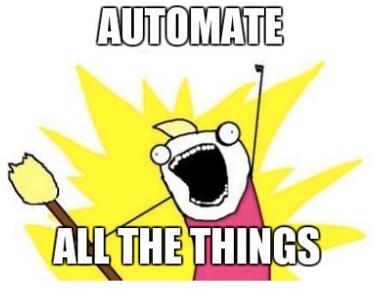
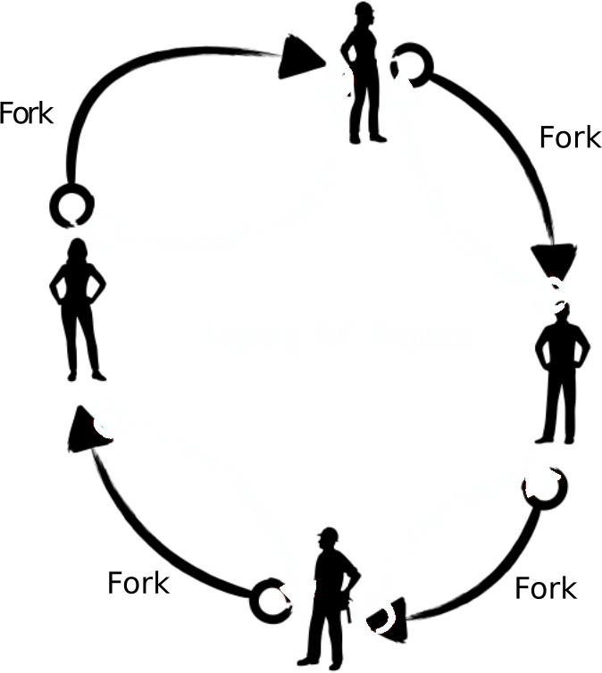

<!--
title: Continuous Integration
description: Automate All The things!
author: Ole Mussmann, Olga Lyashevska
version: 4.3.1
plugins: RevealMarkdown, RevealChalkboard, RevealHighlight, RevealMath.KaTeX, RevealMenu, RevealNotes, RevealSearch, RevealZoom
-->

<!-- .slide: data-state="blue_overlay yellow_flag yellow_strip purple_half_circle_bottom purple_blob right_e_top" data-background-video="./files/steampunk-85358.mp4" data-background-video-loop data-background-video-muted="true" data-auto-animate data-auto-animate-id="title" -->

# Continuous Integration (CI)

---

<!-- .slide: data-state="blue_overlay 9 yellow_flag logo" data-background="./files/reload-97640.svg" data-background-size="50%" data-auto-animate data-auto-animate-id="what" -->

# Continuous Integration (CI)

  

     It is the practice of integrating changes to a project made by individuals into a main, shared version frequently.
    <h4>&mdash;https://book.the-turing-way.org</h4>
  

---

<!-- .slide: data-state="blue_overlay yellow_flag yellow_strip purple_half_circle_bottom purple_blob right_e_top" data-background-video="./files/steampunk-85358.mp4" data-background-video-loop data-background-video-muted="true" data-auto-animate data-auto-animate-id="title" -->

# Motivation
How can we implement __automatic testing__ each time we push changes to the repository? 

---

<!-- .slide: data-state="blue_overlay yellow_flag logo 9" data-background="./files/reload-97640.svg" data-background-size="50%" -->

## CI enables automatic testing!

Allows to identify any conflicts and bugs that are introduced by changes, so they are found and fixed early, minimising the effort required to do so. 

---

<!-- .slide: data-state="blue_overlay yellow_flag logo 9" data-background="./files/reload-97640.svg" data-background-size="50%" -->

## What else can CI do?
- Building & compiling
- Documentation, ...
- Deploying (PyPi, Kubernetes, GitHub Pages)
  - Just like these slides
- Linting (analyze code for potential errors)
- Security analyses
- Send messages
  - Slack, Discord, Matrix, Mastodon, email, ...

---

<!-- .slide: data-state="blue_overlay yellow_flag logo 9" data-background="./files/reload-97640.svg" data-background-size="50%" -->

## CI service providors

- GitHub Actions
- GitLab CI
- Azure Pipelines
- Jenkins
- etc

---

<!-- .slide: data-state="blue_overlay yellow_flag logo 9" data-background="./files/reload-97640.svg" data-background-size="50%" -->

## Take-away

- Best practices are a time-investment _with returns_
- CI saves time and keeps your project clean
- What improvements could your project benefit from?
- What's nice to know, but overkill for your current work?

---

<!-- .slide: data-state="blue_overlay yellow_flag logo 9" data-background="./files/reload-97640.svg" data-background-size="50%" -->

## Hands-On

  <ol>
    <li><strong>Person A: </strong>Ensure your repository has tests</li>
    <li><strong>Person A: </strong>Set up Continuous Integration (automatic testing)</li>
    <li><strong>Person A: </strong>Verify that tests ran</li>
    <li><strong>Person A: </strong>Add a test that fails</li>
    <li><strong>Person A: </strong>Open an issue</li>
    <li><strong>Person B: </strong>Fork ⚠️ and clone person A's repo</li>
    <li><strong>Person B: </strong>Fix the broken test</li>
    <li><strong>Person B: </strong>Open a pull request linked to the issue</li>
    <li><strong>Person B: </strong>Verify that tests now run</li>
    <li><strong>Person A: </strong>Accept Person B's pull request</li>
  </ol>

