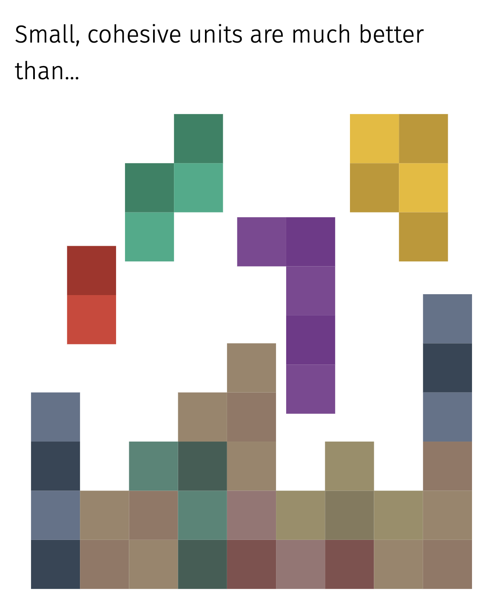
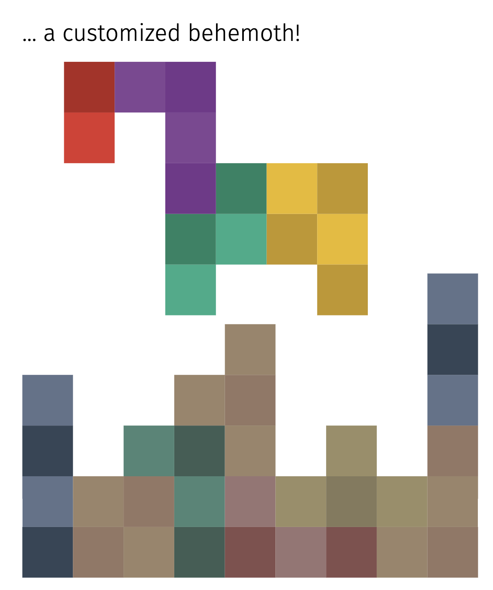
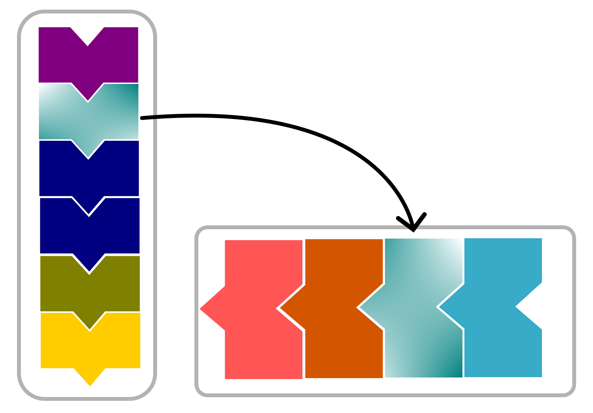
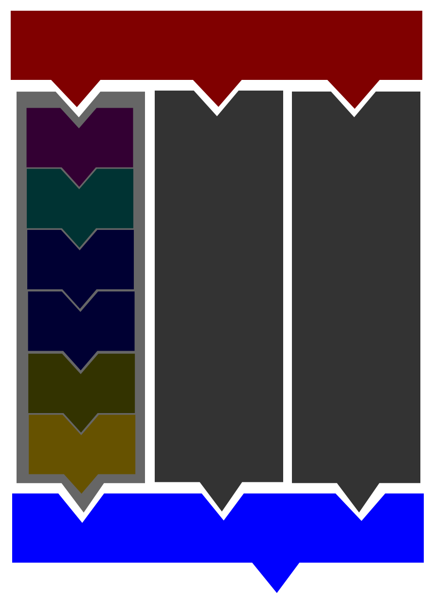
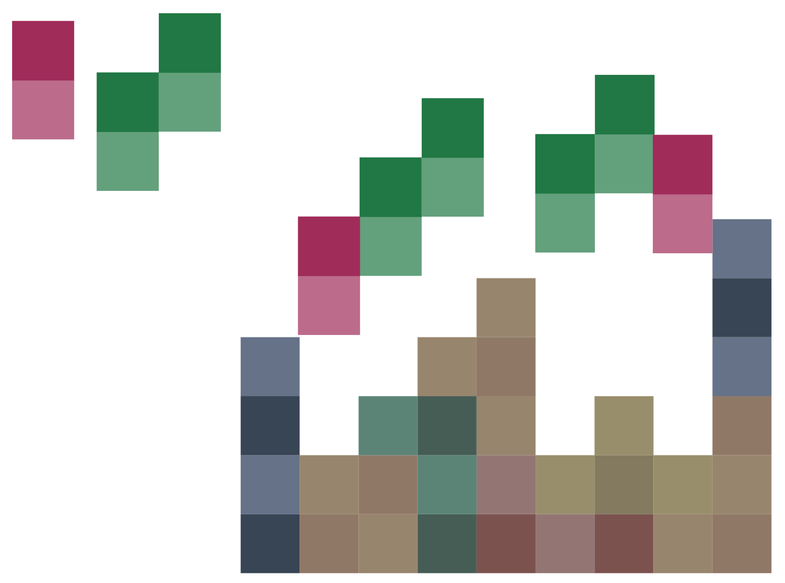
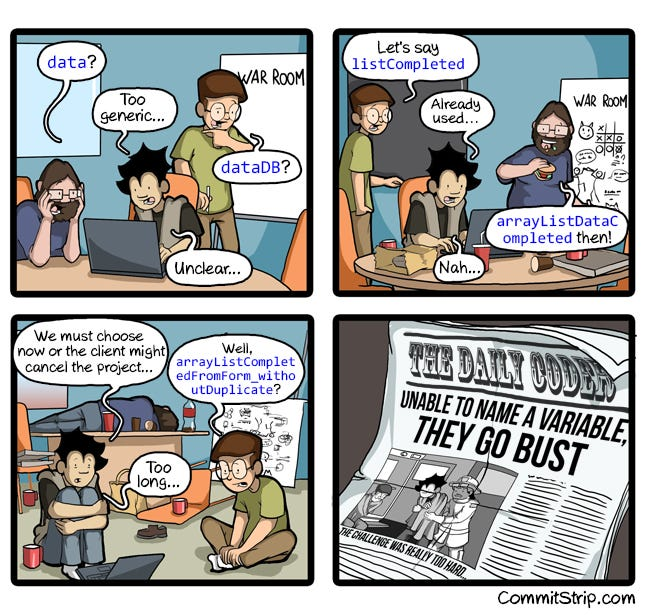

<!--
title: Code Modularization
description: Writing Modular Code
author: Barbara Vreede, Ole Mussmann, Dani Bodor
version: 4.4.0
plugins: RevealMarkdown, RevealChalkboard, RevealHighlight, RevealMath.KaTeX, RevealMenu, RevealNotes, RevealSearch, RevealZoom
-->

<!-- .slide: data-state="blue_overlay yellow_flag yellow_strip purple_half_circle_bottom purple_blob right_e_top" data-background-video="./files/Mood video Homepage 2.mp4" data-background-video-loop data-background-video-muted="true" -->

# Developing Modular Code

---

<!-- .slide: data-state="standard" data-background="./files/whitebg.png"  -->

## What is modularity?

Simple components combined to produce complex behavior.

- Software can be 'built up' from smaller elements.
<!-- .element: class="fragment" data-fragment-index="3" -->
- Elements are self-contained and independent.
<!-- .element: class="fragment" data-fragment-index="4" -->
- Each element handles a specific (set of) task(s).
<!-- .element: class="fragment" data-fragment-index="5" -->

<figure style="text-align: center; margin-top: 20px;">
    
        <figcaption style="font-size: 0.3em; color: #666;">Charlie Chaplin in <i>Modern Times</i> (1936).<br>© Roy Export Company Establishment; photograph, the Museum of Modern Art/Film Stills Archive, New York City</figcaption>
</figure>

---

<!-- .slide: data-state="standard" data-background="./files/whitebg.png" -->

## Modular code

<div style="display: flex; justify-content: center; align-items: center; margin-top: 20px;">
  
  
</div>

---

<!-- .slide: data-state="standard" data-background="./files/whitebg.png" -->

## What are these blocks/elements?

- functions
- classes
- modules
- libraries/packages
- programs
- ...

---

<!-- .slide: data-state="standard" data-background="./files/whitebg.png"  -->

## Why write modular code?

To increase robustness


- A well-designed module can be tested.
- This helps keep the codebase well-functioning and bug-free.

---

<!-- .slide: data-state="standard" data-background="./files/whitebg.png"  -->

## Why write modular code?

To make maintenance easier:


- Modular code is more readable and understandable.
- Modules can be debugged separately.
- Modules only need to be improved/optimized once.

---

<!-- .slide: data-state="standard" data-background="./files/whitebg.png"  -->

## Why write modular code?

To allow reusability:



- A module can live independent of its original context.
- It can be reused by another project.

---

<!-- .slide: data-state="standard" data-background="./files/whitebg.png"  -->

## Why write modular code?

To facilitate scalability:




<div>

- Complexity remains low by design.
- This creates space for scaling up.

</div>

---

<!-- .slide: data-state="standard" data-background="./files/whitebg.png"  -->

## Why write modular code?

To create opportunities for innovation:



- Modules increase the capabilities and power of a project.
- Rearrange old modules for new applications.

---

<!-- .slide: data-state="standard" data-background="./files/whitebg.png"  -->
## Why write modular code?

To save time:


---

<!-- .slide: data-state="standard" data-background="./files/whitebg.png"  -->

## A good module...

- performs limited and clearly defined tasks
<!-- .element: class="fragment" data-fragment-index="2" -->
- has a good name
<!-- .element: class="fragment" data-fragment-index="3" -->

---

<!-- .slide: data-state="standard" data-background="./files/whitebg.png"  -->

## Naming your module

- focus on human intelligibility
- be descriptive and clear
- don't use abbreviations
- follow language specific conventions



---

<!-- .slide: data-state="standard" data-background="./files/whitebg.png"  -->

## A good module...

- performs limited and clearly defined tasks
- has a good name
- is readable
<!-- .element: class="fragment" data-fragment-index="2" -->

---

<!-- .slide: data-state="standard" data-background="./files/whitebg.png"  -->

## More readable != shorter code

Shorter:
```python=
indexATG = [n for n,i in enumerate(myList) if i == 'ATG']
indexAAG = [n for n,i in enumerate(myList) if i == 'AAG']
```

More modular:
<!-- .element: class="fragment" data-fragment-index="2" -->
```python=
def getIndex(inputList,z):
    zIndex = [n for n,i in enumerate(inputList) if i == z]
    return zIndex

indexATG = getIndex(myList,'ATG')
indexAAG = getIndex(myList,'AAG')
```
<!-- .element: class="fragment" data-fragment-index="2" -->

---

<!-- .slide: data-state="standard" data-background="./files/whitebg.png"  -->

## A good module...

- performs limited and clearly defined tasks
- has a good name
- is readable
- is pure and predictable
<!-- .element: class="fragment" data-fragment-index="2" -->

---

<!-- .slide: data-state="standard" data-background="./files/whitebg.png"  -->

## An impure function...

... does not always give the same result:

```python=
def fahrenheit_to_celsius(temp_list, conversions=[]):
    for temp in temp_list:
        temp_c = (temp - 32.0) * (5.0/9.0)
        conversions.append(temp_c)
    
    return conversions

>>> fahrenheit_to_celsius([32.0, 77.0])  # [0.0, 25.0]
```

**Q: What will happen when we call the function a second time?**
<!-- .element: class="fragment" data-fragment-index="2" -->

```python=
>>> fahrenheit_to_celsius([32.0, 77.0])  # [0.0, 25.0, 0.0, 25.0]
```
<!-- .element: class="fragment" data-fragment-index="3" -->

---

<!-- .slide: data-state="standard" data-background="./files/whitebg.png"  -->

## A pure function...

... always gives the same result:

```python=
def fahrenheit_to_celsius(temp_list, conversions=None):
    if conversions == None:
        conversions = []
    for temp in temp_list:
        temp_c = (temp - 32.0) * (5.0/9.0)
        conversions.append(temp_c)
    
    return conversions

>>> fahrenheit_to_celsius([32.0, 77.0])  # [0.0, 25.0]
>>> fahrenheit_to_celsius([32.0, 77.0])  # [0.0, 25.0]
```

---

<!-- .slide: data-state="standard" data-background="./files/whitebg.png"  -->

## Identifying opportunities for modularization

- poor readability
<!-- .element: class="fragment" data-fragment-index="2" -->

---

<!-- .slide: data-state="standard" data-background="./files/whitebg.png"  -->

## Readable code

Modular code becomes more readable

- Code is read more than it is written
<!-- .element: class="fragment" data-fragment-index="2" -->
- Does a reader understand what the code does?
<!-- .element: class="fragment" data-fragment-index="3" -->
- Bad readability can be a "code smell"
<!-- .element: class="fragment" data-fragment-index="4" -->

---

<!-- .slide: data-state="standard" data-background="./files/whitebg.png"  -->

## Identifying opportunities for modularization

- poor readability
- functional units
<!-- .element: class="fragment" data-fragment-index="2" -->

---

<!-- .slide: data-state="standard" data-background="./files/whitebg.png"  -->

## Identify functional units

- Don't Repeat Yourself (DRY): place reused code into a function
- Identify potential functions by their _action_
    (e.g. "plot", "transform", "extract", "save")

---

<!-- .slide: data-state="standard" data-background="./files/whitebg.png"  -->

## Identifying opportunities for modularization

- poor readability
- functional units
- nested code
<!-- .element: class="fragment" data-fragment-index="2" -->

---

<!-- .slide: data-state="standard" data-background="./files/whitebg.png"  -->

## Target nested code

Nested code is a prime target for modularization:

```python=
def sum_even_numbers(bottom, top):
    if top > bottom:
        sum = 0
        for x in range(bottom, top):
            if x % 2 == 0:
                sum += x
        return sum
    return 0

sum_even_numbers(2, 14)  # 42
```

---

<!-- .slide: data-state="standard" data-background="./files/whitebg.png"  -->

## Reduce nestedness...

... by extracting modules:

```python=
def _filter_even(number):
    if number % 2 == 0:
        return number
    return 0

def sum_even_numbers(bottom, top):
    if top < bottom:
        return 0
    
    sum = 0
    for x in range(bottom, top):
        sum += _filter_even(x)
    return sum

sum_even_numbers (2,14)  # 42
```

---

<!-- .slide: data-state="standard" data-background="./files/whitebg.png"  -->

## Let tests help you

- Write tests for each individual module
<!-- .element: class="fragment" data-fragment-index="2" -->
- Use the test-writing procedure to look critically at the module's function:
<!-- .element: class="fragment" data-fragment-index="3" -->
    - Is the input/output clear?
<!-- .element: class="fragment" data-fragment-index="3" -->
    - What can you not yet test? Extract it into a new module.
<!-- .element: class="fragment" data-fragment-index="3" -->
