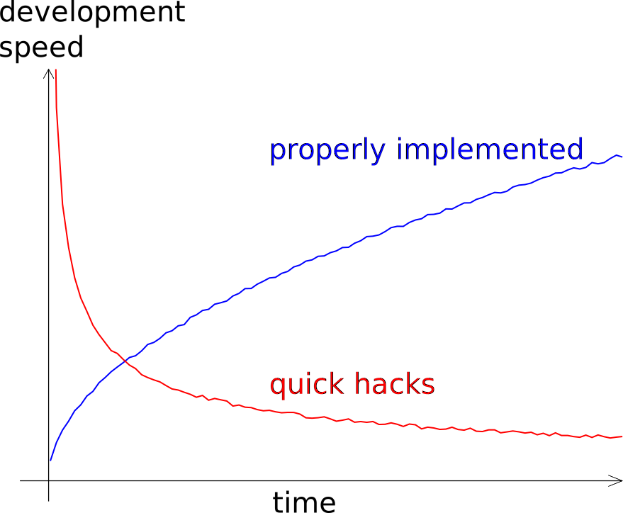

<!--
title: Code Modularization
description: Writing Modular Code
author: Barbara Vreede, Ole Mussmann
version: 4.3.1
plugins: RevealMarkdown, RevealChalkboard, RevealHighlight, RevealMath.KaTeX, RevealMenu, RevealNotes, RevealSearch, RevealZoom
-->

<!-- .slide: data-state="blue_overlay yellow_flag yellow_strip purple_half_circle_bottom purple_blob right_e_top" data-background-video="./files/Mood video Homepage 2.mp4" data-background-video-loop data-background-video-muted="true" -->

# Developing Modular Code

---

<!-- .slide: data-state="standard" data-background="./files/whitebg.png"  -->

## What is modularity?

- Software is 'built up' from smaller elements
- Elements are self-contained and independent
- Each element handles a specific (set of) task(s)

**Simple components** build **complex behavior**.

---

<!-- .slide: data-state="standard" data-background="./files/whitebg.png" -->

## Modular code


---

<!-- .slide: data-state="standard" data-background="./files/whitebg.png" -->

## What are these blocks/elements?

- functions
- classes
- modules
- libraries/packages
- programs

---

<!-- .slide: data-state="standard" data-background="./files/whitebg.png"  -->

## Why write modular code?

To increase robustness:


- A well-designed module can be tested.
- This helps keep the codebase well-functioning and bug-free.

---

<!-- .slide: data-state="standard" data-background="./files/whitebg.png"  -->

## Why write modular code?

To make maintenance easier:


- Modular code is more readable and understandable.
- Modules can be debugged separately.

---

<!-- .slide: data-state="standard" data-background="./files/whitebg.png"  -->

## Why write modular code?

To allow reusability:


- A module can live independent of its original context
- It can be reused by another project

---

<!-- .slide: data-state="standard" data-background="./files/whitebg.png"  -->

## Why write modular code?

To facilitate scalability:


<div>

- Complexity remains low by design
- This creates space for scaling up

</div>

---

<!-- .slide: data-state="standard" data-background="./files/whitebg.png"  -->

## Why write modular code?

To create opportunities for innovation:


- Modules increase the capabilities and power of a project
- Rearrange old modules for new applications

---

<!-- .slide: data-state="standard" data-background="./files/whitebg.png"  -->




<!-- .slide: data-state="standard" data-background="./files/whitebg.png"  -->

## A good module...

- performs limited and clearly defined tasks
- has a good name
<!-- .element: class="fragment" data-fragment-index="2" -->
- is readable
<!-- .element: class="fragment" data-fragment-index="3" -->

---

<!-- .slide: data-state="standard" data-background="./files/whitebg.png"  -->

## Readability =/= shorter code

Shorter:
```python=
indexATG = [n for n,i in enumerate(myList) if i == 'ATG']
indexAAG = [n for n,i in enumerate(myList) if i == 'AAG']
```

More modular:

```python
def get_index(input_list, target):
    """
    Returns the indices of all occurrences of target in input_list.

    Args:
        input_list (list): The list to search through.
        target (any): The element to find in the list.

    Returns:
        list: A list of indices where the target is found.
    """
    return [index for index, value in enumerate(input_list) if value == target]

# Example usage
my_list = ['ATG', 'AAG', 'ATG', 'AAG', 'ATG']
index_atg = get_index(my_list, 'ATG')
index_aag = get_index(my_list, 'AAG')

print("Indices of 'ATG':", index_atg)
print("Indices of 'AAG':", index_aag)
```

---

<!-- .slide: data-state="standard" data-background="./files/whitebg.png"  -->

## A good module...

- performs limited and clearly defined tasks
- has a good name
- is readable
- is pure/does not have a 'state'

---

<!-- .slide: data-state="standard" data-background="./files/whitebg.png"  -->

## A pure function

has no side-effects:

```python=
def fahrenheit_to_celsius(temp_f):
    temp_c = (temp_f - 32.0) * (5.0/9.0)
    return temp_c

>>> temp_c = fahrenheit_to_celsius(temp_f=77.0)
>>> print(temp_c)
25.0
```

---

<!-- .slide: data-state="standard" data-background="./files/whitebg.png"  -->

## A stateful function

changes its environment:

```python=
def fahrenheit_to_celsius(temp_f):
    global temp_c
    temp_c = (temp_f - f_to_c_offset) * f_to_c_factor

>>> f_to_c_offset = 32.0
>>> f_to_c_factor = (5.0/9.0)
>>> temp_c = 0.0
>>> print(temp_c)
0.0
>>> fahrenheit_to_celsius(temp_f=77.0)
>>> print(temp_c)
25.0
```

---

<!-- .slide: data-state="standard" data-background="./files/whitebg.png"  -->

## Identifying opportunities for modularization

---

<!-- .slide: data-state="standard" data-background="./files/whitebg.png"  -->

## Focus on readability

- Modular code becomes more readable
- Code is read more than it is written
- Does a reader understand what the code does?
- Bad readability can be a "code smell"

---

<!-- .slide: data-state="standard" data-background="./files/whitebg.png"  -->

## Identify future functions

- Don't Repeat Yourself (DRY): place reused code into a function
- Identify potential functions by their _action_
    (e.g. "plotting", "transforming", "extracting", "saving")

---

<!-- .slide: data-state="standard" data-background="./files/whitebg.png"  -->

## Target nested code

Nested code is a prime target for modularization (note: removed nested if-statements by using elif to avoid deep nesting):

```python=
def check_temperature(degrees):
    """
    Prints a message indicating the likely scale of the given temperature.
    
    Args:
    degrees (float): The temperature to check.
    """
    if degrees < -459:
        print("This temperature is impossible.")
    elif degrees < -273:
        print("This temperature is likely Fahrenheit.")
    elif degrees < 0:
        print("This temperature is either Celsius or Fahrenheit.")
    else:
        print("This temperature is in Kelvin, Celsius, or Fahrenheit.")

# Example usage
check_temperature(-50)
check_temperature(300)
check_temperature(-100)
check_temperature(5)
```

---

<!-- .slide: data-state="standard" data-background="./files/whitebg.png"  -->

## Reduce nestedness

by extracting modules:

```python=
def is_valid_temperature(degrees):
    """
    Checks if the given temperature is above absolute zero.
    Args:
    degrees (float): The temperature to check.
    Returns:
    bool: True if the temperature is valid, False otherwise.
    """
    return degrees >= -459

def check_temperature(degrees):
    """
    Prints a message indicating the likely scale of the given temperature.
    Args:
    degrees (float): The temperature to check.
    """
    if not is_valid_temperature(degrees):
        return "Invalid temperature"
    
    if degrees < -273:
        print("This temperature is likely Fahrenheit.")
    elif degrees < 0:
        print("This temperature is either Celsius or Fahrenheit.")
    else:
        print("This temperature is in Kelvin, Celsius, or Fahrenheit.")

# Example usage
print(check_temperature(-500))  # Should return "Invalid temperature"
check_temperature(-305)         # Should print "This temperature is likely Fahrenheit."
check_temperature(-150)         # Should print "This temperature is either Celsius or Fahrenheit."
check_temperature(5)           # Should print "This temperature is in Kelvin, Celsius, or Fahrenheit."
```

---

<!-- .slide: data-state="standard" data-background="./files/whitebg.png"  -->

## Let tests help you

- Write tests for each individual module
- Use the test-writing procedure to look critically at the module's function:
    - Is the input/output clear?
    - What can you not yet test? Extract it into a new module.

