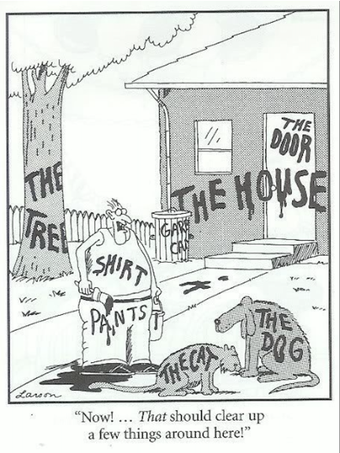

<!--
title: Documentation
description: Day 3 Code Refinery
author: Luisa Orozco, Barbara Vreede
version: 4.3.1
plugins: RevealMarkdown, RevealChalkboard, RevealHighlight, RevealMath.KaTeX, RevealMenu, RevealNotes, RevealSearch, RevealZoom
-->

<!-- .slide: data-state="blue_overlay yellow_flag yellow_strip purple_half_circle_bottom purple_blob right_e_top" data-background-video="./files/Mood video Homepage 2.mp4" data-background-video-loop data-background-video-muted="true" -->

# Documentation

---

<!-- .slide: data-state="standard" data-background="./files/whitebg.png"  -->



---

<!-- .slide: data-state="standard" data-background="./files/whitebg.png"  -->

## Examples of documentation

+ Think of projects with good documentation.
      _What do you like about them?_
+ Think of projects with less good documentation.
      _What don't you like about them? Are you missing anything?_

<quotation>NB: You can choose a mature library with lots of users, but try to also think of less mature projects you had to collaborate on, or papers you had to reproduce.</quotation>

---

<!-- .slide: data-state="standard" data-background="./files/whitebg.png"  -->

## Types of documentation

<div class="fragment">

+ README files
+ In-code documentation
+ API documentation
+ Tutorials
+ ...

</div>

---

<!-- .slide: data-state="standard" data-background="./files/whitebg.png"  -->

## A good README file

+ README file is first thing a user/collaborator sees
+ What should be included in README files?
<ul>
  <li contenteditable="true">...</li>
  <li contenteditable="true">...</li>
  <li contenteditable="true">...</li>
  <li contenteditable="true">...</li>
  <li contenteditable="true">...</li>
  <li contenteditable="true">...</li>
  <li contenteditable="true">...</li>
</ul>


Note:
+ A descriptive project title
+ Motivation (why the project exists) and basics
+ Installation / How to setup
+ Copy-pasteable quick start code example
+ Usage reference (if not elsewhere)
+ Recommended citation if someone uses it
+ Other related tools ("see also")
+ Contact information for the developer(s)
+ License information
+ Contributing guidelines

---

<!-- .slide: data-state="standard" data-background="./files/whitebg.png"  -->

## Why write in-code documentation?

In-code documentation:

+ Makes code more understandable
+ Explains decisions we made

---

<!-- .slide: data-state="standard" data-background="./files/whitebg.png"  -->

## When **not** to use in-code documentation?

+ When the code is self-explanatory
+ To replace good variable/function names
+ To replace version control
+ To keep old (zombie) code around

---

<!-- .slide: data-state="standard" data-background="./files/whitebg.png"  -->

## Readable code vs commented code

```python=
# convert from degrees celsius to fahrenheit
def convert(d):
    return d * 5 / 9 + 32
```
vs
```python=
def celsius_to_fahrenheit(degrees):
    return degrees * 5 / 9 + 32
```

---

<!-- .slide: data-state="standard" data-background="./files/whitebg.png"  -->

## What makes a good comment?

**Comment A**

<pre data-id="code-animation"><code style="overflow: hidden;" data-trim class="python">
# Now we check if temperature is larger than -50:
if temperature > -50:
    print('do something')
</code></pre>

**Comment B**

<pre data-id="code-animation"><code style="overflow: hidden;" data-trim class="python">
# We regard temperatures below -50 degrees as measurement errors
if temperature > -50:
    print('do something')
</code></pre>

How are these different? Which one do you prefer?

---

<!-- .slide: data-state="standard" data-background="./files/whitebg.png"  -->

## Docstrings: a special kind of comment

```python=
def celsius_to_fahrenheit(degrees):
  """Convert degrees Celsius to degrees Fahrenheit."""
  return degrees * 5 / 9 + 32
```

Why is this OK?

Note:
Docstrings can be used to generate user documentation.
They are accessible outside the code.
They follow a standardized syntax.

---

<!-- .slide: data-state="standard" data-background="./files/whitebg.png"  -->

## In-code commenting: key points

+ Explicit, descriptive naming already provides important documentation.
+ Comments should describe the why for your code, not the what.
+ Writing docstrings is an easy way to write documentation while you code, as they are accessible outside the code itself.

---

<!-- .slide: data-state="standard" data-background="./files/whitebg.png"  -->

## User/API documentation

+ What if a README file is not enough?
+ How do I easily create user documentation?

---

<!-- .slide: data-state="standard" data-background="./files/whitebg.png"  -->

## Tools

+ **Sphinx** (documentation generator)
  - creates nicely-formatted HTML pages out of .md or .rst files
  - programming language independent
+ **Github pages** (deploy your documentation)
  - set up inside your GitHub repository
  - automatically deploys your Sphinx-generated documentation

---

<!-- .slide: data-state="standard" data-background="./files/whitebg.png"  -->

## Take-home message

+ Depending on the purpose and state of the project documentation needs to meet different criteria.
+ Documentation can take different shapes:
  + Readable code
  + In-code comments
  + Docstrings
  + README files
  + Tutorials/notebooks
+ Documentation is a vital part of a project, and should be kept and created alongside the corresponding code.