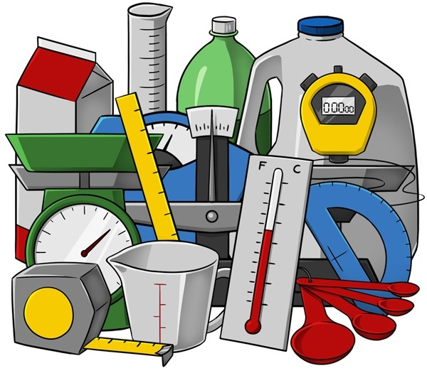

<!--
title: Testing
description: Getting more professional
author: Ole Mussmann
version: 4.3.1
plugins: RevealMarkdown, RevealChalkboard, RevealHighlight, RevealMath.KaTeX, RevealMenu, RevealNotes, RevealSearch, RevealZoom
-->

<!-- .slide: data-state="blue_overlay yellow_flag yellow_strip purple_half_circle_bottom purple_blob right_e_top" data-background-video="./files/606762245.mp4" data-background-video-loop data-background-video-muted="true" -->
<!-- https://pixabay.com/videos/engine-motor-mechanic-technology-5497/ -->

# Testing

---

<!-- .slide: data-state="standard" data-background="./files/whitebg.png" -->

## Basics of testing

### Mistakes *will* happen!


<div style="display: flex; justify-content: center; align-items: center">
    <div>
      <ul>
        <li class="fragment">The more complex the code, the harder to keep an eye on everything.</li>
        <li class="fragment">However, we can build safeguards against problems:
        <ul>
          <li class="fragment">Throwing exceptions</li>
          <li class="fragment">Logging (intermediate) results</li>
          <li class="fragment"><b>Writing tests</b></li>
        </ul></li>
      </ul>
  </div>
    
</div>

---

<!-- .slide: data-state="standard" data-background="./files/whitebg.png" -->

## Why Test?

<div style="display: flex; justify-content: center; align-items: center">
  <div>
    <ul>
      <li class="fragment">Preserve functionality
      <ul>
        <li>Detect (new) errors early</li>
        <li>Avoid unexpected outputs</li>
      </ul></li>
      <li class="fragment">Help users
      <ul>
        <li>Verify correct installation</li>
        <li>Ensure reproducibility</li>
      </ul></li>
      <li class="fragment">Enable developers
      <ul>
        <li>Manage complexity</li>
        <li>Simplify refactoring</li>
        <li>Facilitate collaboration</li>
      </ul></li>
    </ul>
  </div>
    
</div>


---

<!-- .slide: data-state="standard" data-background="./files/whitebg.png" -->

## Test Types

<ul>
  <li class="fragment fade-up">Exceptions in the code base
  <ul>
    <li>Intended to handle "expected" problems</li>
    <li>Sound an alarm as soon as the problem arises</li>
    <li>Provide clear feedback to the user</li>
  </ul></li>
  <li class="fragment fade-up">Unit testing
  <ul>
    <li>Smallest possible unit (module)</li>
    <li>No dependency on outside code...</li>
    <li>(... replace them with mocks, stubs, etc.)</li>
  </ul></li>
  <li class="fragment fade-up">Integration testing
  <ul>
    <li>Test interactions between units</li>
    <li>Can be on small scales, system wide, ...</li>
  </ul></li>
</ul>

---

<!-- .slide: data-state="standard" data-background="./files/whitebg.png" -->


## Testing metrics

#### Targets are arbitrary and indicative of but do not guarantee strong testing.

<div style="display: flex; justify-content: center; align-items: center">
  <div>
    <ul>
      <li class="fragment fade-up">Coverage
        <ul>
          <li>Proportion of code that is executed</li>
          <li>Target >= 80%</li>
        </ul>
      </li>
      <li class="fragment fade-up">Ratio (lines of code:lines of test)
        <ul>
          <li>Target: (1:3)</li>
        </ul>
      </li>
      <li class="fragment fade-up">Metrics can be misleading
        <ul>
          <li>They do not measure quality</li>
          <li>Don't get blindsided by hitting targets over writing good tests</li>
  </div>
  
</div>

  

---

<!-- .slide: data-state="standard" data-background="./files/whitebg.png" -->

## Misleading metrics

Consider this function...
```python
def fahrenheit_to_celsius(temp_list, converted_temps=[]):
    for temp in temp_list:
        temp_c = (temp - 32.0) * (5.0/9.0)
        converted_temps.append(temp_c)
    return converted_temps
```

...and these tests with 100% coverage:
<!-- .element: class="fragment" data-fragment-index="2" -->
```python
assert fahrenheit_to_celsius([32.0, 77.0]) == [0.0, 25.0]
assert (fahrenheit_to_celsius([100], converted_temps = [0.0, 25.0])
        == [0.0, 25.0, 37.77777777777778])
```
<!-- .element: class="fragment" data-fragment-index="2" -->

Q: Can you think of a problem that will not be caught?
<!-- .element: class="fragment" data-fragment-index="3" -->

---

<!-- .slide: data-state="standard" data-background="./files/whitebg.png" -->


## Writing a test file

Create a file called test_example.py ...
<pre><code class="bash" style="overflow: hidden;" data-trim class="bash" data-line-numbers>
$ mkdir pytest-example
$ cd pytest-example
$ nano test_example.py
</code></pre>

<div class="fragment">
... and add the function and tests from before:
<pre><code class="python" style="overflow: hidden;" data-trim class="bash" data-line-numbers>
def fahrenheit_to_celsius(temp_list, converted_temps=[]):
    for temp in temp_list:
        temp_c = (temp - 32.0) * (5.0/9.0)
        converted_temps.append(temp_c)
    return converted_temps
&nbsp;
&nbsp;
def test_convert():  # Special name!
    assert fahrenheit_to_celsius([32.0, 77.0]) == [0.0, 25.0]
    assert (fahrenheit_to_celsius([100], converted_temps = [0.0, 25.0])
            == [0.0, 25.0, 37.77777777777778])
</code></pre>
</div>

---

<!-- .slide: data-state="standard" data-background="./files/whitebg.png" -->

## Using pytest to run tests in Python

[Pytest](https://docs.pytest.org/en/7.3.x/) is the recommended python testing framework

<pre class="fragment"><code style="overflow: hidden;" data-trim class="bash" data-line-numbers="1|1-9">
$ pytest
======================== test session starts ========================
platform linux -- Python 3.6.9, pytest-7.0.1, pluggy-1.0.0
rootdir: /home/ole/Desktop/pytest-texample
collected 1 item

test_example.py .                                                  [100%]

========================= 1 passed in 0.00s =========================
</code></pre>

The `pytest` command will run all functions starting with "test_" from all files starting with "test_".
<!-- .element: class="fragment" -->

---

<!-- .slide: data-state="standard" data-background="./files/whitebg.png" -->

## Pytest Exercise

1. Add a test to catch "problematic" behavior of the function.
    - don't fix the function (yet)
2. Run pytest to see what the response looks like. 
    - what information can you gather from the response?
3. Fix the function and rerun the test

<div>
<pre><code class="python" style="overflow: hidden;" data-trim class="bash" data-line-numbers>
def fahrenheit_to_celsius(temp_list, converted_temps=[]):
    for temp in temp_list:
        temp_c = (temp - 32.0) * (5.0/9.0)
        converted_temps.append(temp_c)
    return converted_temps
&nbsp;
&nbsp;
def test_convert():
    assert fahrenheit_to_celsius([32.0, 77.0]) == [0.0, 25.0]
    assert (fahrenheit_to_celsius([100], converted_temps = [0.0, 25.0])
            == [0.0, 25.0, 37.77777777777778])
</code></pre>
</div>

---

<!-- .slide: data-state="standard" data-background="./files/whitebg.png" -->

## Breaking the test 

1. Add a test to catch problematic behavior of the function.

<div class="fragment">
<pre><code class="python" style="overflow: hidden;" data-trim class="bash" data-line-numbers="1-11|12">
def fahrenheit_to_celsius(temp_list, converted_temps=[]):
    for temp in temp_list:
        temp_c = (temp - 32.0) * (5.0/9.0)
        converted_temps.append(temp_c)
    return converted_temps
&nbsp;
&nbsp;
def test_convert():
    assert fahrenheit_to_celsius([32.0, 77.0]) == [0.0, 25.0]
    assert (fahrenheit_to_celsius([100], converted_temps = [0.0, 25.0])
            == [0.0, 25.0, 37.77777777777778])
    assert fahrenheit_to_celsius([32.0, 77.0]) == [0.0, 25.0]
</code></pre>
</div>

---

<!-- .slide: data-state="standard" data-background="./files/whitebg.png" -->

## Failing tests

<pre style="width: 100%; max-width: 1200px; overflow: auto;"><code style="overflow: hidden;" data-trim class="bash" data-line-numbers="1|2-8|9-22|23-26">
$ pytest example.py
======================== test session starts =========================
platform linux -- Python 3.6.9, pytest-7.0.1, pluggy-1.0.0
rootdir: /home/ole/Desktop/pytest-texample
collected 1 item

test_example.py F                                                   [100%]

============================== FAILURES ==============================
______________________________ test_convert ______________________________

    def test_convert():  # Special name!
        assert fahrenheit_to_celsius([32.0, 77.0]) == [0.0, 25.0]
        assert (fahrenheit_to_celsius([100], converted_temps = [0.0, 25.0])
                == [0.0, 25.0, 37.77777777777778])
>       assert fahrenheit_to_celsius([32.0, 77.0]) == [0.0, 25.0]
E       assert [0.0, 25.0, 0.0, 25.0] == [0.0, 25.0]
E         
E         Left contains 2 more items, first extra item: 0.0
E         Use -v to get more diff

test_example.py:11: AssertionError
============================= short test summary info =============================
FAILED test_example.py::test_convert - assert [0.0, 25.0, 0.0, 25.0] == [0.0, 25.0]
================================ 1 failed in 0.67s ================================
&nbsp;
</code></pre>

---

<!-- .slide: data-state="standard" data-background="./files/whitebg.png" -->

## Pytest wrap up

- pytest collects all files starting <code>test_</code>...
- ... and runs all test functions starting with <code>test_</code>
- The tests pass when they do not throw (assertion) errors

<pre style="width: max-content;"><code style="overflow: hidden;" class="python" data-trim class="bash" data-line-numbers>
def steal_sheep():
    ...
def paint_cows():
    ...

# optionally in another file:

def test_steal_sheep():
    ...
def test_paint_cows():
    ...
</code></pre>

---

<!-- .slide: data-state="standard" data-background="./files/whitebg.png" -->

## Take-away

- Use pure functions when possible 👌
  - Do you remember what these are? 💭
- Testing does not have to be hard 👏
  - You often test anyway, but then throw the test away 🧐
  - Use pytest if programming with Python 🎭
- You don't have to strive for 💯% test coverage
  - But be smart about what you are testing 🧠
- Aim for a balance between unit- and integration tests ⚖️
- Testing removes the dread of refactoring 🔁
- Your future you (and others!) will thank you 🙏

---

<!-- .slide: data-state="standard" data-background="./files/whitebg.png" -->

## Test-Driven Development: FizzBuzz

<div class="r-stack">
  
  
  
  
  
  
</div>

<ul class="fragment">
  <li>fizz_buzz() takes an integer argument and returns it, BUT</li>
  <ul>
    <li class="fragment" data-fragment-index="1">fails on zero or negative numbers</li>
    <li class="fragment" data-fragment-index="2">instead returns "Fizz" on multiples of 3</li>
    <li class="fragment" data-fragment-index="3">instead returns "Buzz" on multiples of 5</li>
    <li class="fragment" data-fragment-index="5">instead returns "FizzBuzz" on multiples of 3 and 5</li>
  </ul>
</ul>

---

<!-- .slide: data-state="standard" data-background="./files/whitebg.png" -->

## Test driven development assignment:

<ul>
  <li>Create a test function that checks the rules of FizzBuzz:</li>
  <ul>
    <li>fails on zero or negative numbers</li>
    <li>return "Fizz" on multiples of 3</li>
    <li>return "Buzz" on multiples of 5</li>
    <li>return "FizzBuzz" on multiples of 3 and 5</li>
    <li>otherwise return itself</li>
  </ul>
  <li class="fragment">Paste your tests in the collab document, and discuss</li>
  <li class="fragment">Now write a function code to make your tests pass</li>
</ul>

---

<!-- .slide: data-state="standard" data-background="./files/whitebg.png" -->

## Take-away

- What did you think of this style of development?
- Was it easier or harder than just writing code?
- Would your code look different without the tests? <!-- .element class="fragment" -->
- For what kind of projects would it be (not) useful? <!-- .element class="fragment" -->

**Test-Driven Development (TDD) is an optional tool in your toolbox** 🛠️ <!-- .element class="fragment" -->
